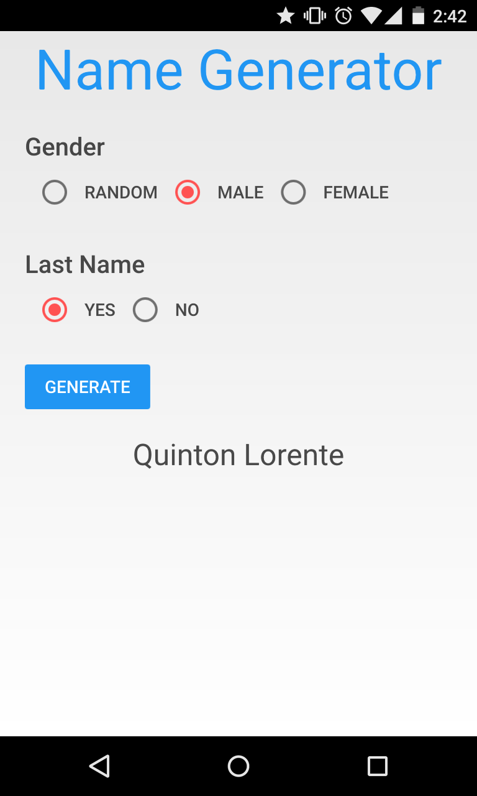

# Name Generator Application

A quick application I made to generate names using the US census. The application is written in QT and QML in particular, while the names are made using Bash. 

## Instructions

First off, you will need to install [QML Material](https://github.com/papyros/qml-material). Installing this theme will allow you to deploy using this theme on desktops. I had to configure the installation a bit to get it running on Android.

Next, run [gen_names.sh](gen_names.sh) to download and format the names from the US census into a more easy to work with format of json.

After that you should be ready to run the application!

Screenshot:

